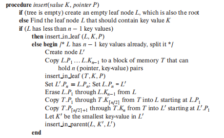
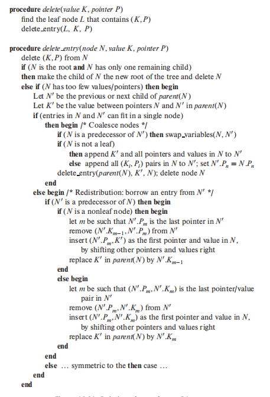

# 数据库


## STORAGE

#### Disk Manager

#### Bufferpool

+ pagetable 哈希表

+ 预取

+ lru链表

+ flush链表

#### 使用磁盘文件来表示数据库的数据

#### Data Storage Model

+ NSM

+ DSM


## INDEX索引

#### 索引分类

##### 数据结构

+ B+树索引

+ 哈希索引

##### 物理存储

+ 聚簇索引

+ 二级索引

#### B+树

##### 数据结构

插入




删除



##### 并发控制

#### 动态哈希表

##### 数据结构

##### 并发控制


## SQL的执行

#### SQL解析

从sql语句生成sql语法分析树

#### query processing

将语法分析树生成一个树状的查询计划，数据从树叶流向根，有三种模型

##### Processing Model

+ Iterator Model（火山模型，open next close）

+ Materialization Model（物化模型）

+ Vectorized Model（向量化模型）

#### SQL优化

##### 连接算法

M个page，m个tuple 连接 N个page，n个tuple，3块磁盘

+ Simple Nested Loop Join

+ Block Nested Loop Join

+ Sort Merge Join：对整体不停n-1归并排序

+ Hash Join


## 日志


#### 概述

##### Write-Ahead Log策略

##### io写入原子性

##### 日志类型

+ 物理日志

+ 逻辑日志

+ 逻辑物理结合


#### redo log

作用：记录对一个页面（索引页，数据页，undo页）的修改

过程：对一个页面修改完后（还在内存），写入redo页

##### redo log格式

+ 物理日志：在某个偏移量修改len长度字节

+ 逻辑物理日志：在某页面插入、删除记录，或者创建页面

##### redo log block

+ 所有的redo 日志写入redo日志文件

+ 而redo日志文件被划分为一个个block，512字节

+ 前四个blog特殊，第一个为log file header，2和4为checkpoint1和2

##### redo log buffer

+

##### redo log组和mini transaction

+

##### log sequence number（lsn）

lsn值记录写入的redo log字节数，初始值为8704

+ flush_lsn

+ buffer pool flush链表的lsn

##### checkpoint的执行

redo log可以被覆盖，意味着，该redo log对应的脏页，已经刷盘了

+ 通过flush链表最末端计算checkpoint lsn

+ 写入到checkpoint block

##### 崩溃恢复

+ 通过最近的checkpoint lsn确定恢复起点

+ 注意，恢复起点到终点的这些日志，并不是全部可以执行！这段日志的操作结果有的已经后台线程刷盘了！这些日志不能重复执行，不是```幂等```

+ 每个页面有一个值，记录最近一次持久化的lsn，如果该值大于checkpoint，则不需执行！


#### undo log

作用：事务在执行一半，忽然宕机，开机后，必须回滚到该事务执行之前的状态

过程：对记录更新之前，写入undo log

##### row pointer

指向undo日志的指针

##### insert的undo log

+ 

##### delete的undo log

+ 中间态，暂时不移入垃圾链表，等事务提交再移入

+ 注意还存储了旧纪录的roll pointer

##### update的undo log

+ 不更新主键（直接删除再插入，日志类似delete）

+ 更新主键（二级索引）（delete+insert两日志）


##### undo页

+ insert类型

+ update类型

##### undo链表（undo段）

+ 每个事务唯一

+ 重用原则

##### 回滚（rollback）段

+ slot

+ cache

+ history

##### undo日志分配、写入过程

+ 分配回滚段

+ 寻找是否有对应缓存slot

+ 没有则寻找一个可用slot

+ 如果非cache，则分配undo seg，将firstpage填入slot

#### undo log删除时机

+ insert类型立马删除

+ update类型，当需要purge的时候，系统最早的readview的事务no若大于等于该history uodo log，则可以放心删除了

##### undo log buffer

刷盘时机

#### arise算法


## 事务

#### ACID

#### 事务并发执行的问题

+ 脏写：修改了另一个事务未提交的数据

+ 脏读：读取到另一个事务未提交的数据

+ 不可重复读：一个事务修改了另一个未提交事务读取的数据

+ 幻读：一个事务两次查询出某些符合条件的数据数量不一致（insert导致）

#### 四大隔离级别

+ 读未提交

+ 读已提交

+ 可重复读

+ 可串行化

#### MVCC

##### readview

注意下面四个值

+ 生成该readview时活跃的读写事务列表：a

+ 列表里最小的事务id：b

+ 生成readview时系统应该分配给下一个事务的id：c

+ 生成该readview的事务id：d

访问版本：

+ 等于d可以读取

+ 小于b能读取

+ 大于等于c则不能读取

+ 在a中则不能读取

+ 不在则可以读取


+ 读未提交：直接读取最新版本

+ 读已提交：每一次读取生成readview

+ 可重复读：第一次读取生成readview（其实，按mvcc策略，它还能避免幻读）

+ 可串行化：加锁读取


#### 锁

##### 共享锁和排他锁

##### 全局锁

锁住整个数据库

##### 表级锁

+ 表锁

+ 元数据锁

+ 意向锁

+ auto_inc锁

##### 行级锁

+ record lock

+ gap lock

+ next-key lock

+ 隐式锁

#### 当前读和快照读

当前读：每次读取的都是最新数据，但是加锁

快照读：按mvcc版本链读取数据


##### 2PL

+ 2PL

+ 死锁检测 检测wait_for_map

+ 死锁预防 wait-die wound-wait


