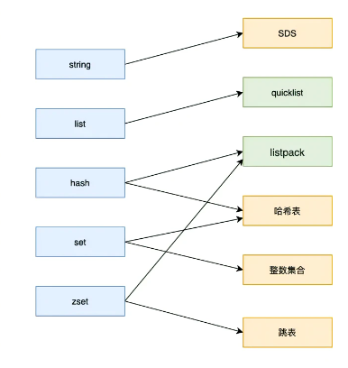

# No SQL数据库

## LSM Tree

## Redis

### 数据类型

##### quicklist

已ziplist作为节点的链表

##### ziplist

bytes tail len entry ... end

prelen encoding type content

##### listpack

encoding data tol len

##### 整数集合

 type len array

##### 哈希表

两个哈希表

渐近式哈希

### 内存淘汰策略

#### AOF

每一条命令，写入内存后，在将命令写入aof文件

##### 落盘时机

+ 每次

+ 每秒

+ 从不

##### AOF重写

+ 子进程cow，对AOF文件进行重写

+ 父进程执行客户端发来的命令，将执行后的写命令追加到AOF 缓冲区；将执行后的写命令追加到AOF 重写缓冲区；

+ 子进程结束，给父进程信号，父进程将AOF重写缓冲区数据写入AOF文件，然后替换之

#### RDB

记录某一时刻内存数据

##### RDB时机

##### RDB写

#### 混合持久化

### redis连接

### 缓存

##### 缓存雪崩

##### 缓存击穿

##### 缓存穿透

### 主从复制

### 内存淘汰

